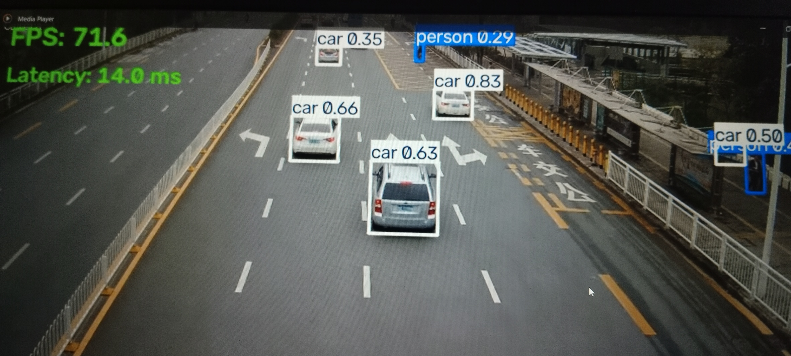

# Edge-Optimized Real-Time Traffic Detection

A real-time object detection pipeline built with **YOLOv8, PyTorch, OpenVINO, NNCF INT8 quantization, and OpenCV**.

The system detects three traffic-related classes:

- Person
- Bicycle
- Car

The main goal of this project is not only object detection, but also **model optimization, quantization, benchmarking, and real-time CPU deployment**.

---

## Project Highlights

- Fine-tuned YOLOv8n on a custom 3-class traffic dataset
- Evaluated model accuracy using mAP@50 and mAP@50-95
- Exported the trained PyTorch model to OpenVINO
- Applied INT8 Post-Training Quantization using NNCF
- Compared OpenVINO floating-point and INT8 performance
- Benchmarked native CPU inference using OpenVINO Benchmark Tool
- Built a real-time OpenCV inference application
- Tested the optimized model using both webcam and traffic video
- Measured accuracy, latency, FPS, and model-size trade-offs

---

## Architecture

```text
Traffic Dataset
      |
      v
YOLOv8n Fine-Tuning
      |
      v
PyTorch Model
      |
      v
OpenVINO Export
      |
      v
NNCF INT8 Quantization
      |
      v
Accuracy Validation
      |
      v
Native CPU Benchmarking
      |
      v
OpenCV Real-Time Deployment
      |
      v
Person / Bicycle / Car Detection
```

---

## Model Performance

### PyTorch Model

| Metric | Result |
|---|---:|
| mAP@50 | 0.522 |
| mAP@50-95 | 0.319 |
| Person AP@50 | 0.698 |
| Bicycle AP@50 | 0.341 |
| Car AP@50 | 0.526 |

---

## INT8 Quantized Model Accuracy

| Metric | PyTorch FP32 | OpenVINO INT8 |
|---|---:|---:|
| mAP@50 | 0.522 | 0.515 |
| mAP@50-95 | 0.319 | 0.313 |
| Person AP@50 | 0.698 | 0.696 |
| Bicycle AP@50 | 0.341 | 0.314 |
| Car AP@50 | 0.526 | 0.534 |

The INT8 model retained most of the original detection accuracy after quantization.

The overall mAP@50 changed from **0.522 to 0.515**, which represents only a small accuracy reduction while significantly reducing model size and improving native inference performance.

---

## Model Size Optimization

| Model | Size |
|---|---:|
| OpenVINO FP | 11.8 MB |
| OpenVINO INT8 | 3.4 MB |

INT8 quantization reduced the model size by approximately **71%**.

---

## Native OpenVINO Benchmark

### Hardware

**Intel Core i7-13620H CPU**

### Input Resolution

**640 × 640**

| Model | Average Latency | Median Latency | Throughput |
|---|---:|---:|---:|
| OpenVINO FP | 21.37 ms | 21.37 ms | 46.52 FPS |
| OpenVINO INT8 | 7.50 ms | 7.35 ms | 131.62 FPS |

### Optimization Result

Compared with the floating-point OpenVINO model, the INT8 model achieved approximately:

- **2.85× lower inference latency**
- **2.83× higher native throughput**
- **71% smaller model size**

This benchmark was measured using the native OpenVINO Benchmark Tool in latency mode.

---

## Real-Time Traffic Video Test

The INT8 OpenVINO model was tested on a traffic video using the OpenCV deployment pipeline.

### Video Details

- Resolution: **848 × 478**
- Original FPS: **25**
- Frames processed: **598**

### Results

- Average processing latency: **16.79 ms**
- Average processing throughput: **59.57 FPS**

The model processed the video faster than its original 25 FPS playback rate, demonstrating real-time CPU capability.

---

## Webcam Test

The real-time application was also tested using a live webcam.

Observed performance:

- Approximate latency: **11–13 ms**
- Approximate processing speed: **75–95 FPS**

The model successfully detected the `person` class in real time.

Actual performance may vary depending on scene complexity, CPU load, and input resolution.

---

## Demo

### Traffic Detection



---

## Tech Stack

- Python
- PyTorch
- Ultralytics YOLOv8
- OpenVINO
- NNCF
- OpenCV
- ONNX
- NumPy

---

## Repository Structure

```text
edge-traffic-detection/
│
├── assets/
│   └── demo_traffic.png
│
├── models/
│   ├── best_openvino_model/
│   └── best_int8_openvino_model/
│
├── outputs/
│   └── traffic_detected.mp4
│
├── benchmark.py
├── realtime_inference.py
├── requirements.txt
├── README.md
└── .gitignore
```

The original PyTorch `.pt` model checkpoints and raw test files are excluded from GitHub using `.gitignore`.

---

## Installation

Clone the repository:

```bash
git clone https://github.com/YOUR-USERNAME/edge-traffic-detection.git
cd edge-traffic-detection
```

Create a virtual environment:

```bash
python -m venv venv
```

Activate it on Windows:

```bash
venv\Scripts\activate
```

Install dependencies:

```bash
pip install -r requirements.txt
```

---

## Run Real-Time Inference

The application supports both webcam and video-file inference.

### Webcam

In `realtime_inference.py`, set:

```python
SOURCE = 0
```

Then run:

```bash
python realtime_inference.py
```

### Traffic Video

Set:

```python
SOURCE = "traffic.mp4"
```

Then run:

```bash
python realtime_inference.py
```

Press `Q` to stop the application manually.

---

## Output Video

The processed traffic video is saved automatically to:

```text
outputs/traffic_detected.mp4
```

The saved video contains:

- Detection bounding boxes
- Class labels
- FPS
- Latency

---

## Python Benchmark

Run:

```bash
python benchmark.py
```

This compares:

- PyTorch FP32
- OpenVINO floating-point model
- OpenVINO INT8 model

The Python benchmark measures application-level prediction timing, which includes framework overhead in addition to model execution.

---

## Native OpenVINO Benchmark

### OpenVINO FP

```bash
benchmark_app -m models/best_openvino_model/best.xml -d CPU -hint latency -t 15
```

### OpenVINO INT8

```bash
benchmark_app -m models/best_int8_openvino_model/best.xml -d CPU -hint latency -t 15
```

The native OpenVINO benchmark measures model inference more directly and showed the largest performance improvement from INT8 quantization.

---

## Why Python and Native Benchmarks Differ

One important observation from this project was that application-level timing and native inference timing can produce different results.

The Python pipeline includes additional overhead such as:

- Image preprocessing
- Python framework overhead
- YOLO postprocessing
- Non-Maximum Suppression
- Bounding-box rendering
- OpenCV operations

The native OpenVINO Benchmark Tool focuses primarily on inference execution.

This is why performance optimization should be measured at both the **model-runtime level** and the **end-to-end application level**.

---

## Accuracy vs Performance Trade-Off

The project demonstrates an edge-AI optimization trade-off:

| Area | FP Model | INT8 Model |
|---|---:|---:|
| mAP@50 | 0.522 | 0.515 |
| Model Size | 11.8 MB | 3.4 MB |
| Native Latency | 21.37 ms | 7.50 ms |
| Native Throughput | 46.52 FPS | 131.62 FPS |

The INT8 model delivered significantly better deployment efficiency while preserving most of the original model accuracy.

---

## Key Learnings

This project provided hands-on experience with:

- Fine-tuning an object detection model
- Evaluating detection accuracy
- Exporting PyTorch models to OpenVINO
- INT8 Post-Training Quantization
- NNCF calibration
- CPU inference optimization
- Native performance benchmarking
- Real-time video processing using OpenCV
- Understanding latency vs throughput
- Measuring accuracy vs performance trade-offs
- Building an end-to-end edge AI deployment pipeline

---

## Future Work

Possible extensions include:

- Native C++ OpenCV + OpenVINO inference implementation
- Intel integrated GPU benchmarking
- TensorRT benchmarking on NVIDIA hardware
- ByteTrack object tracking
- Structured pruning
- Embedded deployment on Jetson or Raspberry Pi
- Multi-camera traffic monitoring
- Vehicle counting and traffic analytics

---

## Author

**Deepak Kumar**

AI / Machine Learning | Computer Vision | Edge AI
